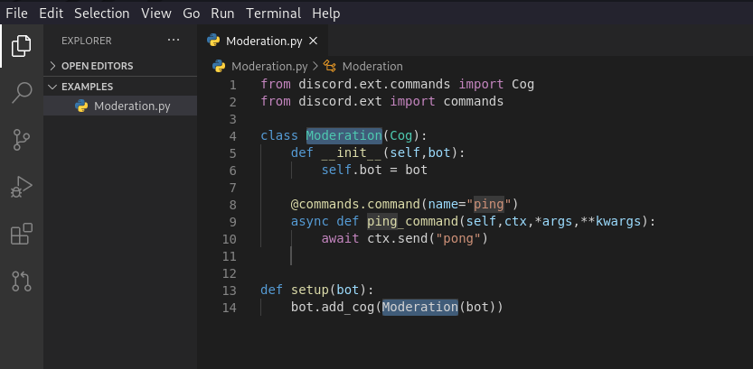

# Python DiscordAPI VSCode Extension

[](https://github.com/TropicalShadow/PythonDiscordAPIVSCodeExtension/issues) 
[](https://github.com/TropicalShadow/PythonDiscordAPIVSCodeExtension/stargazers) [](https://github.com/TropicalShadow/PythonDiscordAPIVSCodeExtension)  [](https://discord.gg/nxxTu9DZG5)

## Features

- Snippets
- Create Bot Command



-----------------------------------------------------------------------------------------------------------

## Extension Settings

<!--
Include if your extension adds any VS Code settings through the `contributes.configuration` extension point.

This extension contributes the following settings: -->

>Coming Soon ```* `pythondiscordapivscodeextension.botname`: name for which the Discord bots variable should be named. I.E. client / bot```

-----------------------------------------------------------------------------------------------------------
<!-- ## Known Issues -->

## Release Notes

> Very unstable and untested

### 0.0.1

- Initial release

### 0.0.1 - Alpha

- Extension Files added

## [1.0.0] 2020-08-08

- Snippets added
  - Cog Template
  - Cog Command and command aliases

### Removed

- Hello World Default Command

## [1.1.0] 2020-8-11

- Snippets added
  - Main Bot
  - Main Bot command and command aliases
- Create Bot Command ```ctrl+shift+p``` -> Create Bot

## [1.1.1] 2020-8-11

- Changed Generated code for Cog as template code doesn't work
- snippet main code.
  - `token=token` -> `TOKEN`
  - `if cog.endswith(".py"):`

### [1.1.2] 2021-10-15

- Changed main bot snippet
- Discord Cog Listeners
- Renamed `bot-cog` to `cog` for easier reading
- Fixed really long wait time for bot command to complete

-----------------------------------------------------------------------------------------------------------

### For more information

- **Discord** - RealName_123#2570 | RealName_123#8866

> Everythin will be fine...

**Enjoy!!!**
